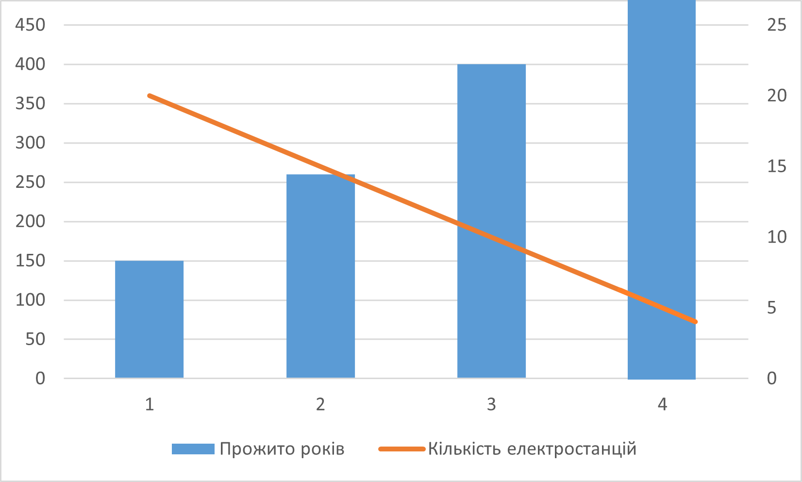
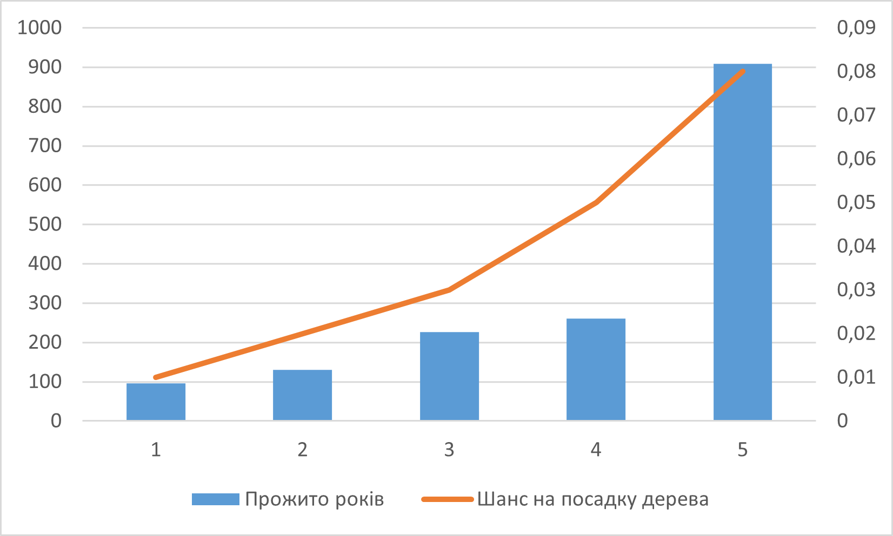
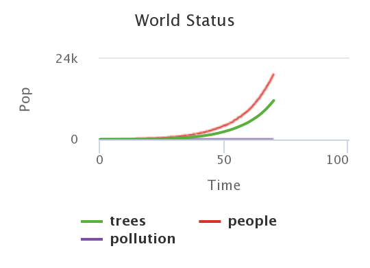

## Комп'ютерні системи імітаційного моделювання
## СПм-23-3, **Риков Владислав Андрiйович**
### Лабораторна робота №**1**. Опис імітаційних моделей та проведення обчислювальних експериментів

 

### Варіант 4, модель у середовищі NetLogo:
[Urban Suite - Pollution](http://www.netlogoweb.org/launch#http://www.netlogoweb.org/assets/modelslib/Curricular%20Models/Urban%20Suite/Urban%20Suite%20-%20Pollution.nlogo)

 

### Вербальний опис моделі:
Дослідження моделювання екосистеми типу "хижак-жертва" із застосуванням моделі Urban Suite - Pollution спрямоване на вивчення взаємодії між популяціями людей, елементів ландшафту та роями забруднюючих агентів, які діють як конкуренти за ресурси в замкнутому середовищі. У цій моделі люди можуть пересуватися, саджати дерева для зниження забруднення та розмножуватися за умови належного стану здоров’я. Забруднення, що створюється заводами, поширюється по сітці та негативно впливає на здоров’я людей, виступаючи своєрідним хижаком, тоді як люди виконують роль здобичі.
Поведінка популяцій в межах екосистеми демонструє дві можливі динаміки: регулярні та нерегулярні коливання чисельності. Регулярні коливання популяцій, що відображаються як циклічні зміни щільності, вказують на стабільність та рівновагу в екосистемі, забезпечуючи збереження обох популяцій протягом тривалого часу. Водночас нерегулярні коливання вказують на дисбаланс і потенційну загрозу вимирання однієї або обох груп. Модель встановлює негативний зворотний зв'язок: щільність популяції хижаків (забруднення) обмежується чисельністю здобичі (людей), і навпаки — популяція здобичі стимулює зростання хижаків. Цей баланс є вирішальним для розуміння довготривалої стійкості або можливого вимирання в межах екосистеми.
### Принцип роботи моделі:
У моделі Urban Suite - Pollution електростанції виступають джерелами забруднення, яке поширюється по навколишньому середовищу та негативно впливає на здоров'я людей, знижуючи їхні репродуктивні можливості. Особи, які зберігають здатність до розмноження, можуть народжувати здорових дітей, що залежить від встановленого рівня народжуваності. Для зменшення рівня забруднення люди можуть застосовувати еко-ініціативи, такі як висаджування дерев, що виступають природними бар'єрами для поширення забруднюючих речовин.

У моделі враховується також природне зниження здоров'я людей, навіть за відсутності забруднення, що врешті-решт призводить до їх природної смерті. Щоб підтримувати чисельність людської популяції, передбачено механізм клонування з певною швидкістю (керується параметром НАРОДЖУВАННЯ). Екосистема досягає стабільності за умови, що рівень забруднюючих речовин підтримується на контрольованому рівні, а популяції людей і природні ресурси (елементи ландшафту) не перевищують потенціал навколишнього середовища.

В моделюванні, побудованому на основі агентів, поведінка кожного агента регулюється певним набором правил, що визначають їхні дії в межах всієї системи.

### Керуючі параметри:
- INITIAL-POPULATION визначає кількість людей, створених на початку моделювання.
- BIRTH-RATE контролює ймовірність народження потомства. Початковий показник 0.10 означає, що кожна людина має 10% шанс народити дитину за рік, за умови, що її здоров’я становить 4 або більше балів.
- PLANTING-RATE визначає ймовірність посадки дерева людиною. Початковий показник 0.05 означає, що шанси на посадку дерева складають 5% на рік.
- POWER-PLANTS визначає кількість електростанцій, створених на початку моделювання.
- POLLUTION-RATE регулює кількість забруднення, яке кожена електростанція виробляє за рік. Забруднення поширюється на сусідні клітини і знижує здоров'я людей. Кожна людина втрачає 0.1 бала здоров'я щорічно, а додаткове забруднення може зменшувати здоров'я ще більше, прискорюючи їхню смерть і зменшуючи шанси на розмноження

### Внутрішні параметри:
- people — Кількість людей в екосистемі.
- trees — Кількість дерев, які можуть очищати забруднення.
- pollution — Рівень забруднення в кожій клітині екосистеми.
- health — Рівень здоров'я кожної людини.

### Показники роботи системи:
- **Динаміка чисельності населення** — відображає зміну кількості людей у межах екосистеми з часом, що дозволяє аналізувати вплив забруднення і рівня народжуваності на популяцію.
- **Динаміка рівня забруднення** — показує, як рівень забруднюючих речовин змінюється протягом часу, відображаючи вплив викидів від електростанцій та дії дерев, що очищують повітря.
- **Динаміка кількості дерев** — характеризує зміни у чисельності дерев, які відіграють ключову роль у зниженні забруднення. Цей показник дозволяє оцінити активність людей у висаджуванні дерев і їхню присутність в екосистемі.
- **Статус системи (World Status)** — інтегрований графік, що демонструє одночасно кількість людей, дерев і рівень забруднення, відображаючи зміни цих параметрів протягом функціонування моделі.

### Примітки:
1) Збільшення кількості дерев ефективно знижує рівень забруднення, що сприяє зростанню чисельності людей у системі.
2) У реальних умовах електростанції потребують постійної участі людини для ефективного функціонування, але ця модель не враховує необхідність людського нагляду для роботи електростанцій.
3) За умовчанням налаштувань параметрів моделі, чисельність населення в симуляції коливається від 200 осіб і може потенційно зростати до великих значень, забезпечуючи тривале існування популяції, що може сягати понад 200 років.

### Недоліки моделі:
1) Відсутність умов для розмноження - ц моделі не враховуються жодні умови для появи нащадків, такі як кількість батьків або їх стать, що спрощує процес репродукції.
2) Незалежність забруднення від розташування електростанцій - потужність забруднення в моделі не залежить від місця розташування та групування електростанцій, що знижує точність симуляції впливу локальних джерел забруднення.
3) Ігнорування медичних інтервенцій — відсутність моделі, яка дозволяє лікувати або зменшувати шкоду від забруднення через медичні втручання
4) Нехтування розвитком інфраструктури — модель не враховує можливість створення інфраструктури для зменшення забруднення, такої як очисні споруди, системи фільтрації або інші інженерні рішення
5) Відсутність природного поширення дерев — дерева не можуть розмножуватися самостійно за допомогою насіння, що обмежує їхню здатність до природного поширення та ефективного очищення середовища

 

## Обчислювальні експерименти

### 1. Вплив кількості електростанцій на тривалість життя популяції
Досліджуються параметри POWER-PLANTS та YEARS.
Керуючі параметри мають значення:
- INITIAL-POPULATION=30
- BIRTH-RATE=0.1
- PLANTING-RATE=0.05
- POLLUTION-RATE=3

<table>
<thead>
<tr><th>Прожито років</th><th>Кількість електростанцій</th></tr>
</thead>
<tbody>
<tr><td>150</td><td>20</td></tr>
<tr><td>253</td><td>15</td></tr>
<tr><td>400</td><td>10</td></tr>
<tr><td>~1000-∞</td><td>5</td></tr>
</tbody>
</table>

Графік показує, що чим менше електростанцій тим довше життя людей.

### 2. Вплив ймовірності посадки дерев на тривалість життя популяції
Досліджується показник життя популяціх в роках - YEARS в залежності від PLANTING-RATE.
Керуючі параметри мають значення:
- INITIAL-POPULATION=30
- BIRTH-RATE=0,09
- POWER-PLANTS=3
- POLLUTION-RATE=1

<table>
<thead>
<tr><th>Прожито років</th><th>Шанс на посадку дерева</th></tr>
</thead>
<tbody>
<tr><td>97</td><td>0,01</td></tr>
<tr><td>123</td><td>0,02</td></tr>
<tr><td>234</td><td>0,03</td></tr>
<tr><td>260</td><td>0,05</td></tr>
<tr><td>904</td><td>0,08</td></tr>
</tbody>
</table>

Графік показує, що збільшення ймовірності посадки дерев позитивно впливає на популяцію людей
 
### 3. Вплив залежності швидкості посадки дерев від показника народжуваності 
Досліджується залежність швидкості посадки дерев PLANTING-RATE від показника народжуваності BIRTH-RATE.
Керуючі параметри мають значення:
- INITIAL-POPULATION=30
- BIRTH-RATE=0.1
- PLANTING-RATE=0.05
- POLLUTION-RATE=1
- POWER-PLANTS=3

<table>
<thead>
<tr><th>Кількість дерев через 200 років</th><th>Максимальна кількість одночасно посажених дерев</th><th>BIRTH-RATE</th></tr>
</thead>
<tbody>
<tr><td>71 (у 75 року всі померли)</td><td>69</td><td>0,02</td></tr>
<tr><td>32 (у 102 року всі померли)</td><td>90</td><td>0,05</td></tr>
<tr><td>35 (у 144 року всі померли)</td><td>133</td><td>0,08</td></tr>
<tr><td>180</td><td>180</td><td>0,1</td></tr>
<tr><td>12213 (кількість населення у ~75 року - 21475)</td><td>11589</td><td>0,15</td></tr>
</tbody>
</table>

Аналіз графіку показує, що зі збільшенням показника народжуваності зростає й кількість дерев, які висаджуються кожен цикл моделі (рік). За рівня народжуваності (birth-rate) ≥ 0,1 спостерігається значне навантаження на систему, оскільки швидкість висадки дерев стає надто високою для екосистеми, що створює умови для "нескінченного" існування популяції. Така ситуація призводить до того, що популяція людей зберігає стійкість і продовжує існувати необмежено довго.

 

## Висновок
Під час експерименту було виявлено, що тривалість життя популяції залежить не лише від кількості електростанцій, але й від їх розташування. Відстань і положення електростанцій відносно людських поселень впливають на рівень забруднення, який досягає популяції, а отже, і на здоров’я людей.