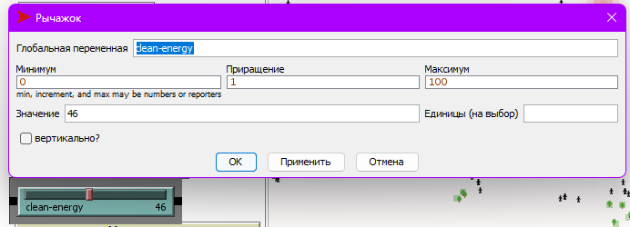
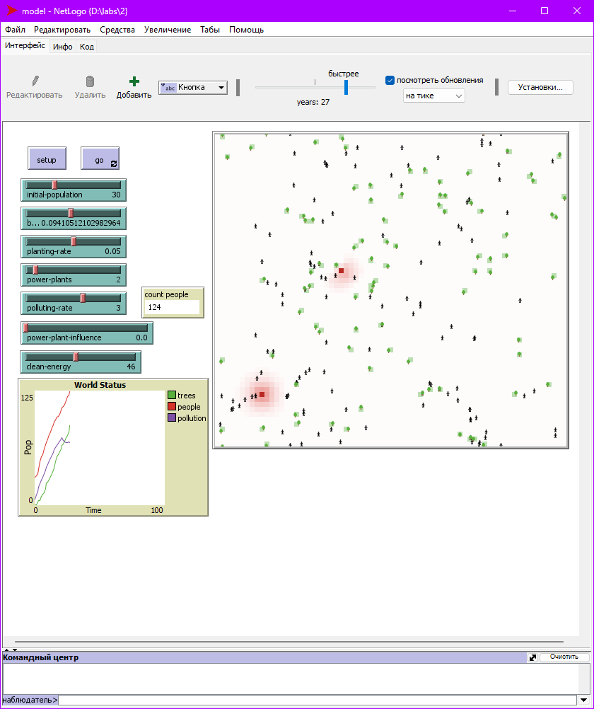
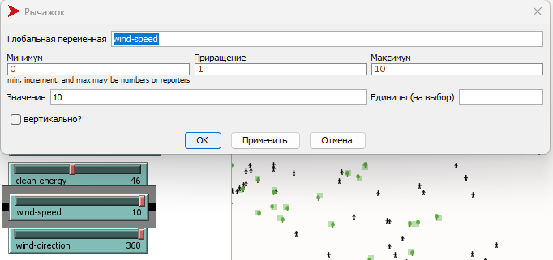
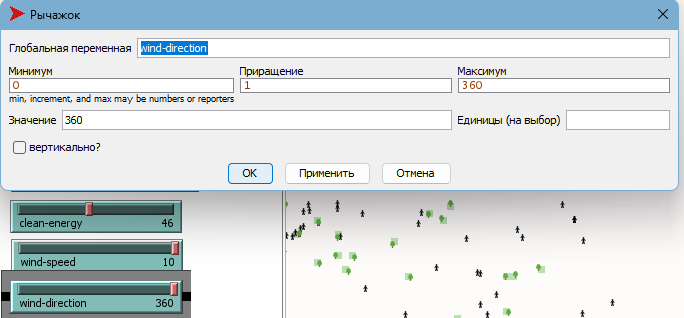
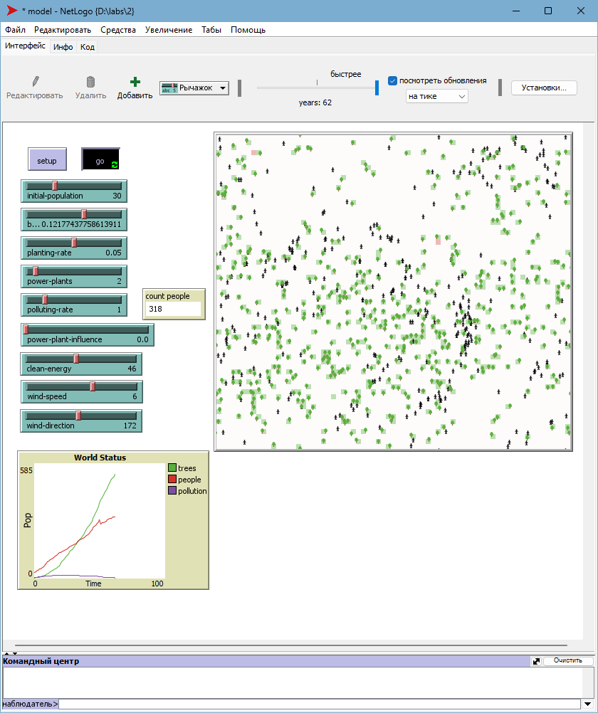

## Комп'ютерні системи імітаційного моделювання
## СПм-23-3, **Риков Владислав Андрiйович**
### Лабораторна робота №**2**. Редагування імітаційних моделей у середовищі NetLogo

 

### Варіант 4, модель у середовищі NetLogo:
[Urban Suite - Pollution](https://www.netlogoweb.org/launch#http://www.netlogoweb.org/assets/modelslib/Curricular%20Models/Urban%20Suite/Urban%20Suite%20-%20Pollution.nlogo)

 

## Внесені зміни у вихідну логіку моделі, за варіантом:

### **Реалізувати позитивний вплив наявності на імітаційному полі електростанцій на вірогідність появи нових людей:**

#### 1) Реалізовано позитивний вплив електростанцій на вірогідність народження нових людей:
Додано функцію, що враховує **power-plant-influence** для кожної клітини, дозволяючи відслідковувати вплив електростанцій на сусідні клітини. Вплив електростанцій тепер збільшує ймовірність появи нових людей та сприяє висадці дерев, що позитивно позначається на загальній динаміці екосистеми.

<pre>
to reproduce  ;; person procedure
  if health > 4 and random-float 1 < birth-rate + power-plant-influence [
    hatch-people 1 [
      set health 5
    ]
  ]
end
</pre>

<pre>
to update-clean-energy-effect
   ask patches with [clean-energy > 0] [
     ask neighbors [
        set birth-rate birth-rate + (clean-energy * 0.000000000001)
     ]
   ]
end
</pre>

##### Логіка роботи функції:
1. **Розмноження** (`reproduce`): Процедура, яка виконується для кожної людини, перевіряє рівень її здоров’я та коригує ймовірність народження потомства з урахуванням **power-plant-influence**. Якщо здоров’я більше 4 і ймовірність відповідає розрахунковій формулі `birth-rate + power-plant-influence`, створюється нова людина зі здоров’ям, встановленим на 5.
2. **Вплив чистої енергії** (`update-clean-energy-effect`): Для клітин з наявним значенням `clean-energy` виконується перевірка сусідніх клітин, у яких показник народжуваності (`birth-rate`) збільшується на малу величину, залежно від `clean-energy`. Це дозволяє моделі враховувати позитивний вплив чистої енергії на народжуваність.

#### 2) Нова функція для обчислення **power-plant-influence** (Вплив електростанції)
Розроблено нову функцію, яка створює та оновлює значення показника **power-plant-influence**.
Ця функція дозволяє моделі динамічно оновлювати вплив кожної електростанції на її оточення, відображаючи ефекти забруднення, що поширюється в сусідні ділянки.

<pre>
to update-power-plant-influence
  ask patches with [is-power-plant? = true] [
    ask neighbors [
      set power-plant-influence power-plant-influence + 0.1
    ]
  ]
end
</pre>

##### Логіка роботи функції:
1. Для всіх ділянок (`patches`), які є електростанціями (`is-power-plant? = true`), виконується запит до сусідніх ділянок.
2. Кожна сусідня ділянка отримує приріст значення **power-plant-influence** на 0.1, що відображає локальне збільшення впливу електростанції на навколишні ділянки.

### **Збільшити вірогідність висадки дерев у клітинах поблизу електростанцій:**

#### 1) Додав важіль clean-energy для регулювання рівня чистої енергії в моделі:
Додано важіль **clean-energy** з діапазоном значень від 0 до 100, що дозволяє керувати рівнем чистої енергії, яка впливає на народжуваність та інші екологічні показники моделі. Цей важіль допомагає моделювати позитивний вплив чистої енергії на довкілля, зокрема на ймовірність народження нових людей та висадки дерев.

<pre>
to maybe-plant  ;; person procedure
  if random-float 1 < planting-rate + power-plant-influence [
    hatch-trees 1 [
      set health 5
      set color green
    ]
  ]
end
</pre>

##### Логіка роботи функції:
1. **Посадка дерев** (`maybe-plant`): Функція перевіряє ймовірність посадки дерева для кожної особи, використовуючи формулу `planting-rate + power-plant-influence`. Якщо значення випадкового числа менше розрахункового рівня, створюється нове дерево з початковим здоров’ям 5 і зеленим кольором.
2. **Роль важеля clean-energy**: Значення важеля **clean-energy** може впливати на загальний рівень екологічної чистоти моделі, що, у свою чергу, підвищує шанси на висадку дерев та стабілізує екосистему, забезпечуючи довготривале виживання популяції.

## **Модель у процесі симуляції:**

## Внесені зміни у вихідну логіку моделі, на власний розсуд:

### Додано вплив вітру на розповсюдження забруднення

#### 1) Новий метод **move** для симуляції вітру
Реалізовано метод **move**, що відповідає за напрямок і швидкість руху вітру. Він враховує випадкові зміни напряму та швидкість руху вітру, які впливають на розподіл кольору та стан клітин.

<pre>
to move  ;; wind-path procedure
  rt random-float 30 - random-float 30
  fd wind-speed
  if pcolor = red [ set color blue - 2 ]
end
</pre>

##### Логіка роботи функції `move`:
1. **Зміна напрямку вітру**: Метод використовує випадкове значення для обертання (`rt random-float 30 - random-float 30`), що створює динамічну зміну напрямку вітру.
2. **Рух вперед**: Після обертання об’єкт переміщується вперед на відстань, визначену **wind-speed**. Ця дія впливає на забруднені ділянки.
3. **Зміна кольору забруднених клітин**: Якщо клітина має колір `red` (що позначає забруднення), вона змінює колір на темніший відтінок синього, що символізує вплив вітру на розсіювання забруднення.

#### 2) Зміни у методі `pollute` для врахування швидкості вітру
Зменшено вплив забруднення зі збільшенням швидкості вітру. Тепер метод **pollute** зменшує рівень забруднення залежно від значення **wind-speed**, що моделює розсіювання забруднення під дією вітру.

<pre>
to pollute  ;; patch procedure
  if is-power-plant? [
    set pcolor red
    set pollution polluting-rate
  ]
  
 if pollution > 0 [
    set pollution pollution - (pollution * wind-speed / 100)
  ]

  set pcolor scale-color red (pollution - .1) 5 0
end
</pre>

##### Логіка роботи функції `pollute`:
1. **Ініціалізація забруднення**: Якщо клітина є електростанцією (`is-power-plant?`), їй присвоюється червоний колір (`pcolor red`) і встановлюється початковий рівень забруднення (`pollution polluting-rate`).
2. **Зменшення забруднення під дією вітру**: Якщо рівень забруднення більше 0, він знижується пропорційно до швидкості вітру (`pollution - (pollution * wind-speed / 100)`). Це моделює ефект розсіювання забруднюючих речовин у вітряну погоду.
3. **Відображення кольору забруднення**: Колір клітини змінюється відповідно до рівня забруднення, що допомагає візуалізувати його розповсюдження та розсіювання в екосистемі.

#### 3) Оновлення параметра **patches-own**:

<pre>
patches-own [
  pollution
  is-power-plant?
  wind-speed
  wind-direction
]
</pre>

#### 4) Замість змінних **wind-speed** та **wind-direction** у **patches-own** було додано два важелі для керування параметрами вітру.

### Дослідження виконаних змін:
**Вплив швидкості вітру на забрудненність середовища:**
Досліджується вплив значень параметру **wind-speed** на показники **count-people**, **trees**, **pollution**.
Експерименти проводяться при таких параметрах:
- **initial-population**: 30
- **birth-rate**: 0.1
- **power-plants**: 2
- **polluting-rate**: 3
- **planting-rate**: 0.05

**Результати експерименту:**

<table>
<thead>
<tr><th>Швидкість вітру</th><th>Дерева max</th><th>Населення max</th><th>Забруднення max</th></tr>
</thead>
<tbody>
<tr><td>0</td><td>82</td><td>41</td><td>135</td></tr>
<tr><td>2</td><td>87</td><td>43</td><td>115</td></tr>
<tr><td>4</td><td>91</td><td>45</td><td>76</td></tr>
<tr><td>6</td><td>88</td><td>44</td><td>66</td></tr>
<tr><td>8</td><td>64</td><td>46</td><td>57</td></tr>
<tr><td>10</td><td>52</td><td>47</td><td>37</td></tr>
</tbody>
</table>

### Висновок
У результаті експерименту встановлено, що зі збільшенням швидкості вітру рівень забруднення знижується завдяки його розсіюванню, що, в свою чергу, підвищує ймовірність розмноження та посадки нових дерев. Це позитивно впливає на чисельність популяції людей та сприяє збільшенню середньої тривалості їхнього життя в екосистемі.

