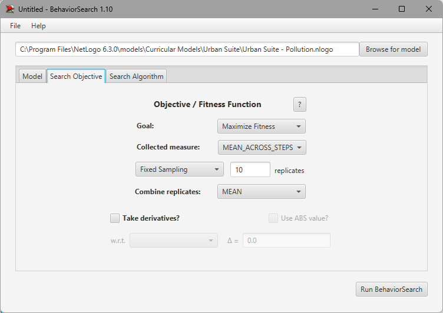
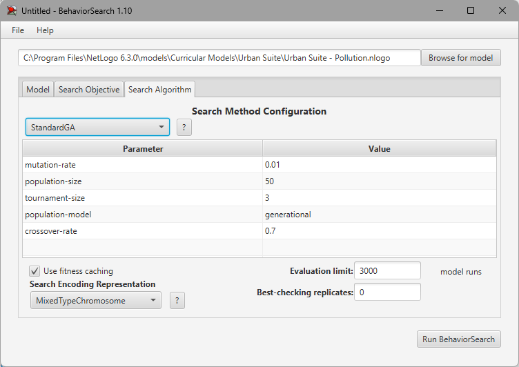
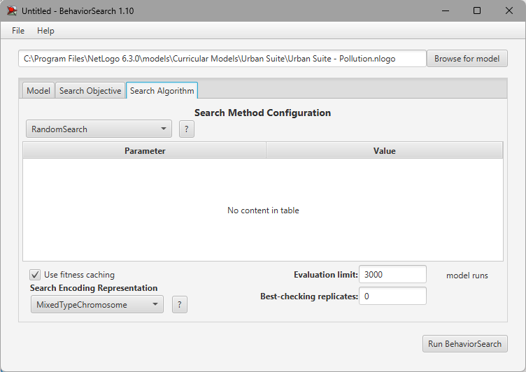
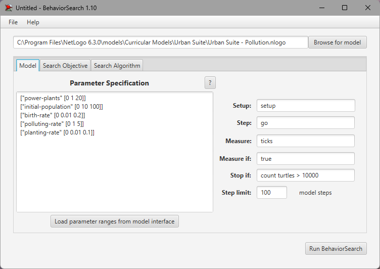
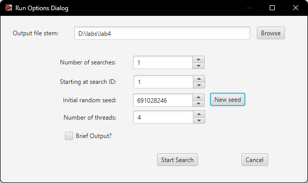
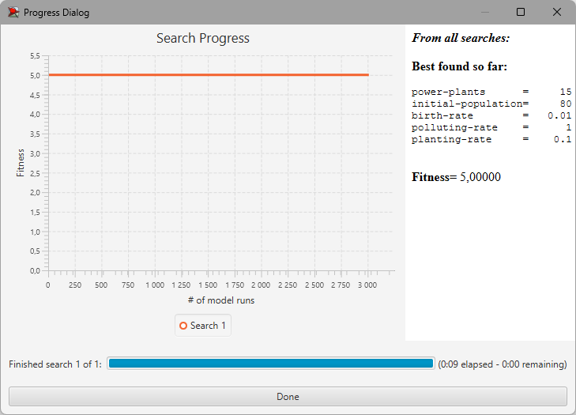
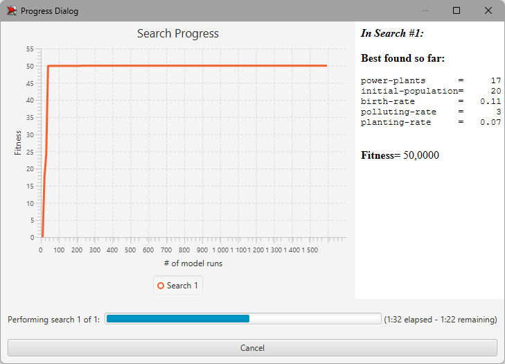

## Комп'ютерні системи імітаційного моделювання
## СПм-23-3, **Риков Владислав Андрiйович**
### Лабораторна робота №**3**. Використання засобів обчислювального интелекту для оптимізації імітаційних моделей

 

### Варіант 4, модель у середовищі NetLogo:
[Urban Suite - Pollution](http://www.netlogoweb.org/launch#http://www.netlogoweb.org/assets/modelslib/Curricular%20Models/Urban%20Suite/Urban%20Suite%20-%20Pollution.nlogo)

 

### Вербальний опис моделі:
Для виконання завдання лабораторної роботи використовується модель Urban Suite - Pollution, що досліджує рівновагу екосистеми "хижак-жертва". У цій моделі популяції людей, елементів ландшафту та рої забруднювачів конкурують за ресурси у замкнутому середовищі. 
Модель дозволяє спостерігати динамічну взаємодію популяцій упродовж тривалого часу: забруднення виступає в ролі "хижака", що негативно впливає на людей ("здобич"). Завдяки цьому можна аналізувати поведінку обох популяцій протягом кількох поколінь та оцінювати їхній репродуктивний успіх.
Регулярні коливання чисельності популяцій вказують на стабільність і баланс в екосистемі, де популяції зберігаються у часі, незважаючи на циклічні зміни. Натомість нерегулярні коливання свідчать про нестабільність, що може призвести до потенційного вимирання обох взаємозалежних популяцій. Модель використовує негативний зворотний зв’язок: збільшення хижаків (забруднення) зменшує чисельність здобичі (людей), а зростання популяції здобичі, у свою чергу, стимулює щільність хижаків. Це забезпечує баланс, що сприяє тривалому існуванню екосистеми.

### Як працює модель:
Електростанції в моделі виступають джерелами забруднення, яке поступово поширюється у навколишнє середовище. Забруднення негативно впливає на здоров’я людей, знижуючи їхні шанси на розмноження. Лише ті особи, чий стан здоров’я дозволяє відтворення, можуть народжувати здорових дітей, відповідно до встановленого рівня народжуваності. 
Для пом’якшення наслідків забруднення люди можуть вживати заходів, представлених у моделі висадкою дерев. Присутність дерев сприяє зниженню рівня забруднення, допомагаючи зберігати баланс у екосистемі.
Навіть за відсутності забруднення здоров’я людей природним чином погіршується з часом, що зрештою призводить до природної смерті. Для підтримки чисельності людської популяції в моделі реалізовано механізм клонування людей із заданою швидкістю (регулюється повзунком "НАРОДЖУВАННЯ"). 
Стабільність екосистеми досягається, коли рівні забруднюючих речовин контролюються, а популяції людей та елементи ландшафту не перевищують можливості навколишнього середовища. Як і в інших моделях на основі агентів, правила визначають поведінку кожного агента в межах його ролі у системі.

### Керуючі параметри моделі
- **initial-population** — визначає кількість людей, створених на початку моделювання.
- **power-plants** — контролює кількість електростанцій, які створюються на старті симуляції.
- **polluting-rate** — визначає кількість забруднення, що виробляє кожна електростанція за рік, яке потім поширюється на сусідні клітини і знижує рівень здоров'я людей.
- **birth-rate** — контролює ймовірність народження потомства.
- **planting-rate** — визначає ймовірність посадки дерева кожною людиною.

### Внутрішні параметри моделі
- **people** — кількість людей в екосистемі, яка може змінюватися залежно від рівня народжуваності та впливу забруднення.
- **trees** — кількість дерев, що сприяють зниженню рівня забруднення в екосистемі.
- **pollution** — рівень забруднення в кожній клітині, який впливає на здоров’я людей та їхню здатність розмножуватися.
- **health** — рівень здоров'я кожної людини, який знижується під впливом забруднення, зменшуючи їхню тривалість життя та шанси на розмноження.

### Показники ефективності системи
- **Динаміка чисельності населення** — відображає зміну кількості людей в екосистемі з часом, дозволяючи оцінити, як забруднення і рівень народжуваності впливають на популяцію.
- **Динаміка кількості дерев** — характеризує зміни в чисельності дерев, які допомагають зменшити рівень забруднення. Показник демонструє активність посадки дерев людьми і кількість дерев, що залишаються в екосистемі.
- **World Status** — інтегрований графік, що відображає одночасно кількість людей, дерев і рівень забруднення, показуючи зміни цих параметрів у часі під час роботи моделі.

### Налаштування середовища BehaviorSearch:
**Обрана модель**:
<pre>
C:\Program Files\NetLogo 6.3.0\models\Curricular Models\Urban Suite\Urban Suite - Pollution.nlogo
</pre>

### **Налаштування параметрів моделі**:
#### 1) Вкладка Search Objective
**Налаштування цільової функції**:  
Метою підбору параметрів імітаційної моделі є **максимізація** значення прожитих років. Це вказано через параметр "**Goal**" зі значенням **Maximize Fitness**, що означає оптимізацію моделі для досягнення максимальної тривалості життя популяції. Задача полягає у визначенні таких параметрів моделі, при яких люди через процеси життя, розмноження та посадки дерев сприяють покращенню атмосфери, що в свою чергу збільшує кількість прожитих років окремої особи та час, доступний для розмноження і висадки нових дерев.
Параметр "**Collected measure**", що визначає спосіб обліку значень обраного показника, встановлено як **MEAN_ACROSS_STEPS**. Це означає, що значення обраної міри (кількості прожитих років) обчислюється як середнє за всіма кроками симуляції.
Щоб уникнути викривлення результатів через випадкові значення, що виникають у логіці імітаційної моделі, **кожна симуляція повторюється по 10 разів**, а підсумкове значення розраховується як **середнє арифметичне**.

Загальний вигляд вкладки налаштувань цільової функції:  

#### 2) Вкладка Search Algorithm
**Налаштування алгоритму пошуку**:  
Загальний вид вкладки налаштувань алгоритму пошуку для **Генетичного алгоритму**:
- **mutation-rate**: 0.01 — ймовірність мутації, що визначає частоту випадкових змін у значеннях параметрів кожного покоління.
- **population-size**: 50 — розмір популяції, який визначає кількість можливих рішень, оцінених на кожному етапі алгоритму.
- **tournament-size**: 3 — розмір турніру, що визначає кількість рішень, які беруть участь у відборі для кросовера.
- **population-model**: generational — тип моделі популяції, в якому всі члени замінюються новим поколінням на кожному кроці.
- **crossover-rate**: 0.7 — ймовірність кросовера, яка визначає частоту обміну генетичною інформацією між рішеннями під час створення наступного покоління.

Загальний вид вкладки налаштувань алгоритму пошуку для **випадкового пошуку**:

#### 3) Вкладка Model
*Параметри та їхні можливі діапазони були **автоматично** вилучені середовищем BehaviorSearch із вибраної імітаційної моделі за допомогою кнопки «Завантажити діапазони параметрів із інтерфейсу моделі».*
<pre>
["planting-rate" [0 0.01 0.1]]
["power-plants" [0 1 20]]
["birth-rate" [0 0.01 0.2]]
["polluting-rate" [0 1 5]]
["initial-population" [0 10 100]]
</pre>

1) Використовувана **міра**:  
Для фітнес-функції *(також відомої як функція пристосованості або цільова функція)* було обрано **Кількість прожитих років**. Оскільки параметр **years** відображає загальну кількість років, прожиту популяцією, і напряму пов'язаний із кількістю тактів (ticks), у параметр **Measure** було записано наступне:
<pre>
    ticks
</pre>

Кількість років життя популяції враховується за весь період симуляції, тривалість якого становить 3000 тактів, починаючи з 0-го такту. 
*Параметр "**Measure if**" зі значенням `true` забезпечує врахування всіх тактів симуляції, а не лише частини. Це може бути корисно, оскільки на початку моделювання деякі такти можуть містити хаотичні значення, які не відображають стабільну поведінку системи. Наприклад, подібна ситуація описана в документації BehaviorSearch.*
Параметри "**Setup**" та "**Go**" вказують процедури ініціалізації та запуску в логіці моделі, які BehaviorSearch використовує автоматично під час роботи для запуску симуляції.

2) Умова зупинки симуляції
Параметр **Stop if** використовується для запобігання надмірним навантаженням на обчислювальні ресурси. Зокрема, симуляція припиняється, якщо кількість черепах (turtles) перевищує 10,000:
<pre>
    count turtles > 10000
</pre>

Це дозволяє підтримувати стабільність моделювання та уникати перевантаження комп'ютера.

3) Параметри запуску симуляції
- **Setup** — процедура ініціалізації моделі, яка встановлює початкові значення та параметри перед початком симуляції.
- **Step (Go)** — процедура, яка виконує крок симуляції, оновлюючи стан всіх агентів та об’єктів у моделі на кожному такті.
- **Step limit** — обмеження на кількість кроків симуляції. У прикладі встановлено значення `100`, що означає, що симуляція триватиме максимум 100 кроків, якщо не буде досягнуто умови зупинки.

Загальний вигляд вкладки налаштувань параметрів моделі:  

 

### Результати використання BehaviorSearch:
Діалогове вікно запуску пошуку:
- **Number of searches**: 1 — кількість незалежних запусків пошуку. У цьому випадку виконується один пошук.
- **Starting at search ID**: 1 — ідентифікатор початкового пошуку, який використовується для маркування результатів.
- **Initial random seed**: 691028246 — початкове значення випадкової "зернини" (seed) для генератора випадкових чисел, що забезпечує відтворюваність результатів. Кнопка **New seed** дозволяє генерувати нове випадкове значення.
- **Number of threads**: 4 — кількість потоків, які будуть використовуватися для виконання паралельних обчислень, що може покращити продуктивність на багатоядерних процесорах.

Результат пошуку параметрів імітаційної моделі, використовуючи **випадковий пошук**:
- **Найкращі знайдені параметри**:
  - **power-plants** = 15
  - **initial-population** = 80
  - **birth-rate** = 0.01
  - **polluting-rate** = 1
  - **planting-rate** = 0.1

Результат пошуку параметрів імітаційної моделі, використовуючи **генетичний алгоритм**:
- **Оптимальні параметри** 
  - **power-plants** = 17
  - **initial-population** = 20
  - **birth-rate** = 0.11
  - **polluting-rate** = 3
  - **planting-rate** = 0.07

### Висновок
Як видно з результатів, **випадковий пошук** дійсно зайняв менше часу, але отримане значення фітнес-функції було значно нижчим, ніж у випадку використання генетичного алгоритму. Це вказує на те, що, хоча випадковий пошук є швидшим методом для дослідження можливих параметрів моделі, він не гарантує оптимального результату. Генетичний алгоритм, хоч і потребує більше часу, забезпечує набагато вищий рівень фітнесу, оскільки поступово покращує рішення через механізми відбору, кросовера та мутації.
Таким чином, при оптимізації параметрів моделі, якщо пріоритетом є отримання максимального значення фітнес-функції, краще використовувати генетичний алгоритм. Випадковий пошук може бути корисним для швидкого огляду простору можливих рішень або в ситуаціях, коли точність менш важлива, ніж швидкість.
